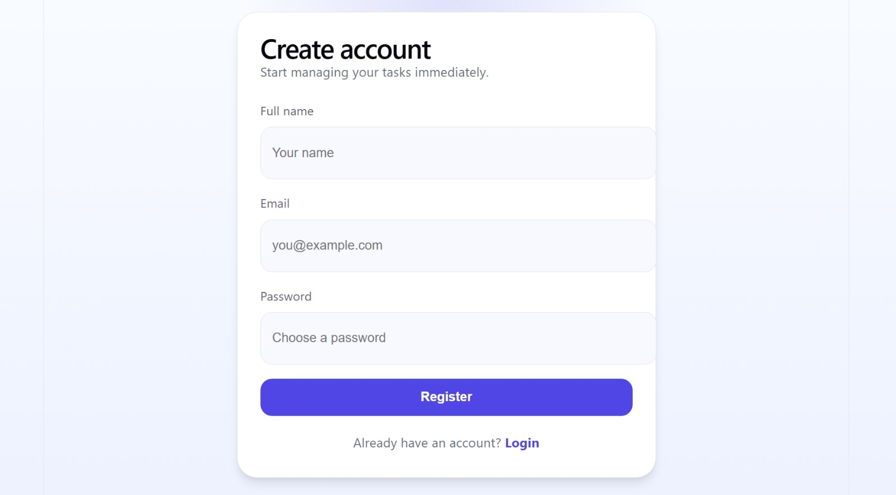
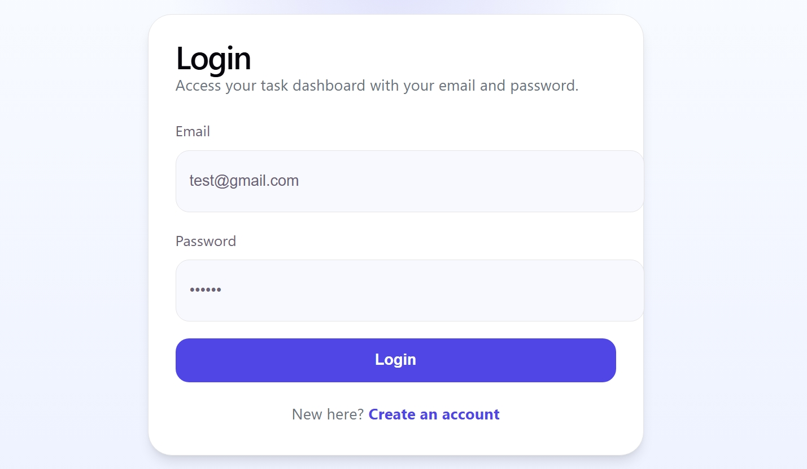
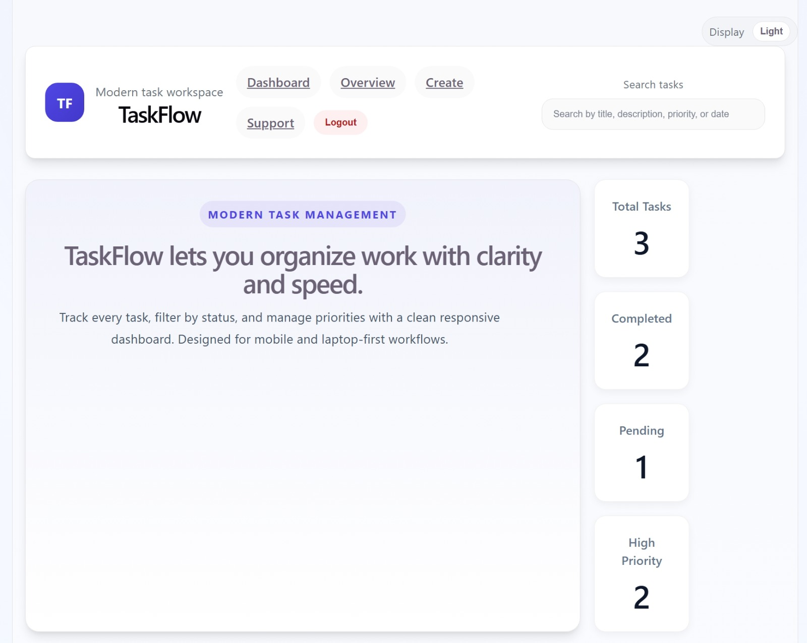
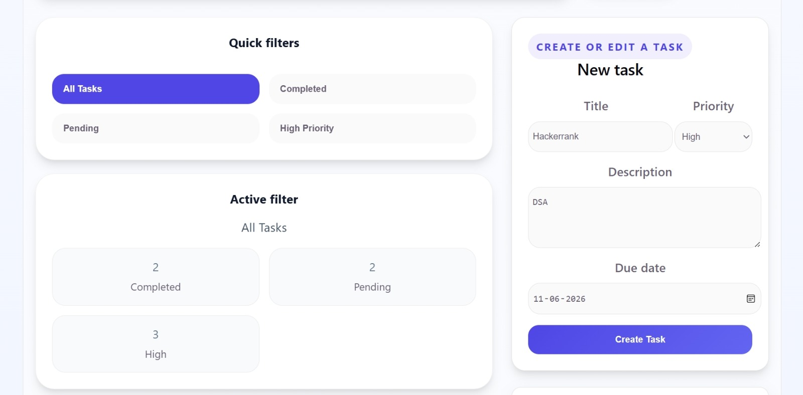
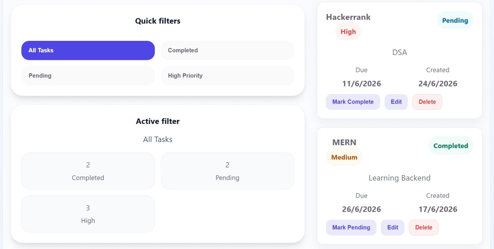

# 🚀 TaskFlow - Full Stack MERN Task Management Dashboard

A modern Full Stack Task Management Application built using the MERN Stack (MongoDB, Express.js, React.js, and Node.js).

TaskFlow enables users to securely register, authenticate, and manage their daily tasks through an intuitive and responsive dashboard. The application supports task creation, updates, deletion, filtering, and real-time task tracking while maintaining secure access through JWT-based authentication.

This project demonstrates industry-standard software development practices including REST API Development, Authentication & Authorization, Protected Routes, Database Integration, Frontend–Backend Communication, MVC Architecture, and Responsive User Interface Design.

---

## 📸 Project Screenshots

### 🔐 User Registration



Secure account creation with user validation and password encryption.

---

### 🔑 User Login



JWT-based authentication system for secure access control.

---

### 📊 Dashboard Overview



Interactive dashboard displaying task statistics, productivity insights, and task management controls.

---

### 📝 Create & Manage Tasks



Create, organize, and manage tasks with priority levels and due dates.

---

### 🎯 Task Filtering & Analytics



Filter tasks based on status and priority while monitoring real-time task statistics.

---

## ✨ Features

### 🔐 Authentication & Security

* User Registration
* User Login
* JWT Authentication
* Protected Routes
* Password Hashing using bcryptjs
* Secure Logout Functionality

### 📝 Task Management

* Create Tasks
* View Tasks
* Update Tasks
* Delete Tasks
* Mark Tasks as Completed
* Mark Tasks as Pending
* Search Tasks
* Task Filtering
* Priority-Based Task Management

### 📊 Dashboard

* Total Tasks Counter
* Completed Tasks Counter
* Pending Tasks Counter
* High Priority Task Counter
* Search Functionality
* Task Statistics Overview

### 🎨 User Interface

* Modern Dashboard Design
* Responsive Layout
* Mobile-Friendly Interface
* Professional User Experience
* Clean and Organized Workflow

---

## 🛠️ Tech Stack

### Frontend

* React.js
* Vite
* React Router DOM
* Axios
* CSS3

### Backend

* Node.js
* Express.js
* MongoDB
* Mongoose
* JSON Web Token (JWT)
* bcryptjs
* dotenv
* cors
* morgan

### Development Tools

* Git
* GitHub
* VS Code
* Postman
* MongoDB Compass

---

## 📂 Project Structure

```plaintext
INTERNSPARK PROJECT1
│
├── frontend
│
│   ├── public
│
│   └── src
│       ├── assets
│       ├── components
│       ├── pages
│       ├── services
│       ├── styles
│       ├── App.jsx
│       ├── main.jsx
│       └── index.css
│
├── task-api
│
│   ├── config
│   ├── Controllers
│   ├── middleware
│   ├── models
│   ├── routes
│   ├── server.js
│   └── package.json
│
├── screenshots
│
└── README.md
```

---

## 🏗️ Application Architecture

```plaintext
User
  │
  ▼
React Frontend
  │
  ▼
Axios API Requests
  │
  ▼
Express Routes
  │
  ▼
Controllers
  │
  ▼
MongoDB Database
```

---

## 🔄 Authentication Workflow

### Registration Process

1. User enters registration details.
2. Password is hashed using bcryptjs.
3. User data is stored in MongoDB.
4. JWT token is generated.
5. Token is returned to the frontend.

### Login Process

1. User enters credentials.
2. Credentials are verified.
3. JWT token is generated.
4. Token is stored on the client.
5. Protected dashboard access is granted.

### Protected Route Access

1. Frontend sends JWT token.
2. Authentication middleware validates the token.
3. User is authorized.
4. Requested resources are returned.

---

## ⚙️ Installation & Setup

### Clone Repository

```bash
git clone https://github.com/mithunsaikumarpanigrahi24cse-commits/task-management-api.git

cd task-management-api
```

### Frontend Setup

```bash
cd frontend

npm install
```

### Backend Setup

```bash
cd ../task-api

npm install
```

### Configure Environment Variables

Create a `.env` file inside the backend directory:

```env
PORT=5000

MONGO_URI=your_mongodb_connection_string

JWT_SECRET=your_secret_key

CLIENT_URL=http://localhost:5173
```

---

## ▶️ Running The Project

### Start Backend Server

```bash
cd task-api

npm start
```

### Start Frontend Application

```bash
cd frontend

npm run dev
```

Frontend URL:

```plaintext
http://localhost:5173
```

Backend URL:

```plaintext
http://localhost:5000
```

---

## 🌐 API Endpoints

### Authentication

```http
POST /api/auth/register

POST /api/auth/login
```

### Task Management

```http
GET    /api/tasks

POST   /api/tasks

PUT    /api/tasks/:id

DELETE /api/tasks/:id
```

---

## 📚 Skills Demonstrated

* Full Stack MERN Development
* REST API Development
* JWT Authentication & Authorization
* MongoDB Database Integration
* MVC Architecture
* Middleware Implementation
* React Hooks
* React Router DOM
* Axios API Integration
* Protected Routes
* Responsive Web Design
* Frontend–Backend Communication
* API Testing using Postman
* Git & GitHub Workflow
* Full Stack Debugging

---

## 🚀 Future Improvements

* Cloud Deployment (Vercel & Render)
* Team Collaboration Features
* Task Sharing Functionality
* Due Date Reminders
* Dashboard Analytics
* Activity Tracking

---

## 👨‍💻 Author

### Mithun Sai Kumar Panigrahi

B.Tech Computer Science Engineering Student

* GitHub: https://github.com/mithunsaikumarpanigrahi24cse-commits
* LinkedIn: https://linkedin.com/in/mithunsaicse2024

---

⭐ If you found this project useful, consider giving it a star.
